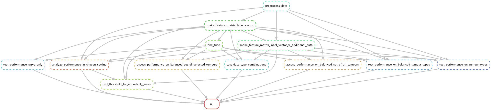

# Transcriptional Classifier for Tumour Samples based on Cancer-related Gene Alterations

## Overview
This repository provides code for classifying tumour sample expression data based on the presence or absence of alterations in any gene of interest. In this classification task, the expression data serves as the feature matrix, and samples are labeled as either "Mutant" or "Wild-type" depending on whether the gene of interest carries any alterations. The status of a gene can be determined using a combination of SNV/INDEL (Single Nucleotide Variations/Small Insertions and Deletions), CNV (Copy Number Variations), and/or SV (Structural Variations) data.

## Input Data
**TCGA (The Cancer Genome Atlas):** 
Expression matrix containing TPM (transcript per million) values and copy number alteration data were obtained from the University of California Santa Cruz repository (RSEM TPM expression and copy number matrices were downloaded from https://xenabrowser.net/ on June 21, 2021 and Oct. 31, 2023 respectively). 
Hg38 MAF files containing SNV/INDEL data were downloaded from: https://portal.gdc.cancer.gov/ on June 2, 2022, and germline mutation data file, PCA_pathVar_integrated_filtered_adjusted.tsv, was downloaded from: https://gdc.cancer.gov/about-data/publications/PanCanAtlas-Germline-AWG on Feb. 14, 2023.  
Structural variation files for all TCGA tumour types were downloaded from https://www.cbioportal.org/ on Oct 4, 2023. 
**POG (Personalized OncoGenomics):** 
The processed expression and all gene variation data files from 608 patients with metastatic disease who were recruited before any chemotherapy or after one line of chemotherapy were downloaded from the Canada’s Michael Smith Genome Sciences Centre servers.

## Workflow

The workflow is visualized below: \

